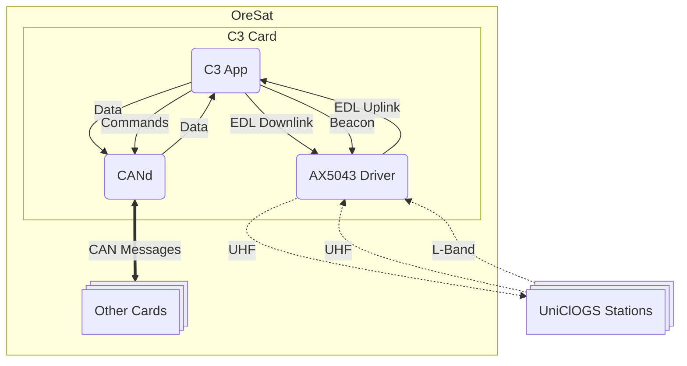

# OreSat C3 Software

Main application for Octavo A8 with Debian Linux version of the C3 card.

The C3 card is the "flight" computer of OreSat. C3 stands for command,
control, and communication. It handles all communications and controls
the state of the satellite.

This is not the only app on the C3, there are two other apps.

- AX5043 Driver offloads control of ax5043 radios. See the [oresat-ax5043-driver] repo.
- CANd offloads the CAN stack. See the [oresat-cand] repo.



## Quick Start

Install dependencies

```bash
pip install .
```

Generate code from configs

```bash
./gen.py code
```

Run the C3 app

```bash
python -m oresat_c3
```

Can mock hardware by using the `-m` or `--mock-hw` flag.

See other options with `-h` flag.

A basic [Bottle]-based website for development and integration can be found at
`http://localhost:8000` when the software is running.

## Documentation

Project uses [Sphinx] to generate documentation.

Documentation is hosted on [Read the Docs], see https://oresat-c3-software.readthedocs.io/en/latest/

To manually build the documentation:

```bash
./gen.py docs
make -C docs html
```

Open `docs/build/html/index.html` in a web browser

## Unit Tests

This project uses python's build in `unittest` module for unit testing.

To run units:

```bash
python -m unittest
```

By default all unit tests run with the hardware mocked. When running on the real
hardware set the `MOCK_HW` environment variable to `"false"` (case insensitive).

To run units when on real hardware:

```bash
MOCK_HW="false" python -m unittest
```

**Note:** The follow environment variables are also available:

- `I2C_BUS_NUM`: The I2C bus number used by the OPD and F-RAM.
- `FRAM_ADDR`: The I2C address for the F-RAM chip. Must be in hex (e.g., `"0x50"`)

[Read the Docs]: https://readthedocs.org
[Sphinx]: https://www.sphinx-doc.org/en/master/
[Bottle]: https://bottlepy.org/docs/dev/
[oresat-ax5043-driver]: https://github.com/oresat/oresat-ax5043-driver
[oresat-cand]: https://github.com/oresat/oresat-cand
