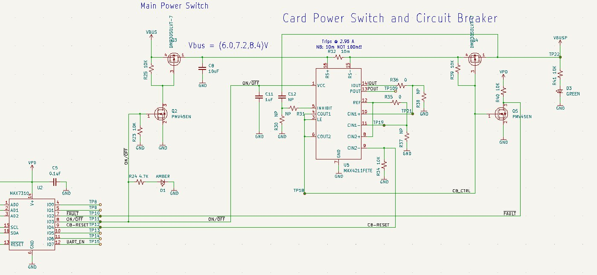

OPD (OreSat Power Domain)
=========================

The OPD allows the C3 to turn other cards on or off, with the exception of the solar cards. The
solar cards are directly power off the output their solar panels and not the batteries. Yes, the
battery cards are also on the OPD, as the batteries will work regardless of the whether the card
is enable or not. Enabling the battery card(s), allows for telemetry from the battery card; i.e.;
voltage level, charge level, etc.

How It Works
------------

Every card, other the solar cards, has a MAX7310  to control giving power to the card.
The MAX7310 is 8-pin GPIO expander with an I2C interface.

3 of the 8 pins are standardized on all cards to be for Not Fault, Enable, and CB Reset.

- **Not Fault Pin**: Is a input pin. When it is High, the circuit is does not have a fault; when
  it is low the circuit has a fault. 
- **Enable Pin**: Is an output pin. When set High, the card is enabled (powered on). When the pin is
  set Low, the card is disable (powered off).
- **CB Reset Pin**: The circuit breaker reset is an output pin. It can reset the enable circuit. When
  held high for a little while, it will hopefully clear the fault.

.. note:: Any pin that is not used is consider a test point and is set low.

OPD on STM32 Cards
******************

On top of the standard 3 pins, the STM32-based cards also utilizes pins for an I2C bootloader and
enabling a UART connection.

- **I2C SCL Pin**: Is an input pin. Used by I2C bootloader.
- **I2C SDA Pin**: Is an input pin. Used by I2C bootloader.
- **Boot Pin**: Is an output pin. When set high before being the Enable pin is set, will put the
  STM32 into bootloader
  mode.
- **UART ENABLE Pin**: Is a output pin. When set high, the cards will be connected to the C3's UART
  bus.

OPD on Ocatvo A8 Cards
**********************

On top of the standard 3 pins, the STM32-based cards also utilizes pins for boot selection pin and
enabling a UART connection.

- **Boot Pin**: Is an output pin. When set high, the card will boot off of the eMMC; when set low,
  the card will boot off of the SD card.
- **UART ENABLE Pin**: Is a output pin. When set high, the cards will be connected to the C3's
  UART bus. This will allow the cards eMMC to be reflashed.

OPD State Machine
-----------------

.. autoclass:: oresat_c3.subsystems.opd.OpdState
   :members:
   :undoc-members:
   :member-order: bysource

.. mermaid::

    stateDiagram-v2
        [*] --> DISABLED
        DISABLED --> ENABLED: Subsystem is enabled
        ENABLED --> DISABLED: Subsystem is disabled
        ENABLED --> FAULT: Subsystem has a fault
        FAULT --> ENABLED: Subsystem was reset and then fault cleared
        FAULT --> DISABLED: Subsystem is disabled
        FAULT --> DEAD: Subsystem failed to reset multiple time in a row

OPD Node State Machine
----------------------

.. autoclass:: oresat_c3.subsystems.opd.OpdNodeState
   :members:
   :undoc-members:
   :member-order: bysource

.. mermaid::

    stateDiagram-v2
        [*] --> DISABLED: Node is found
        [*] --> NOT_FOUND: Node is not found
        NOT_FOUND --> DISABLED: Node is found
        DISABLED --> ENABLED: Node is enabled
        DISABLED --> NOT_FOUND: Node is lost
        ENABLED --> FAULT: Node has a fault
        ENABLED --> NOT_FOUND: Node is lost
        ENABLED --> DISABLED: Node is disabled
        FAULT --> ENABLED: Node was reset and then fault cleared
        FAULT --> NOT_FOUND: Node is lost
        FAULT --> DISABLED: Node is disabled
        FAULT --> DEAD: Node failed to reset multiple time in a row
